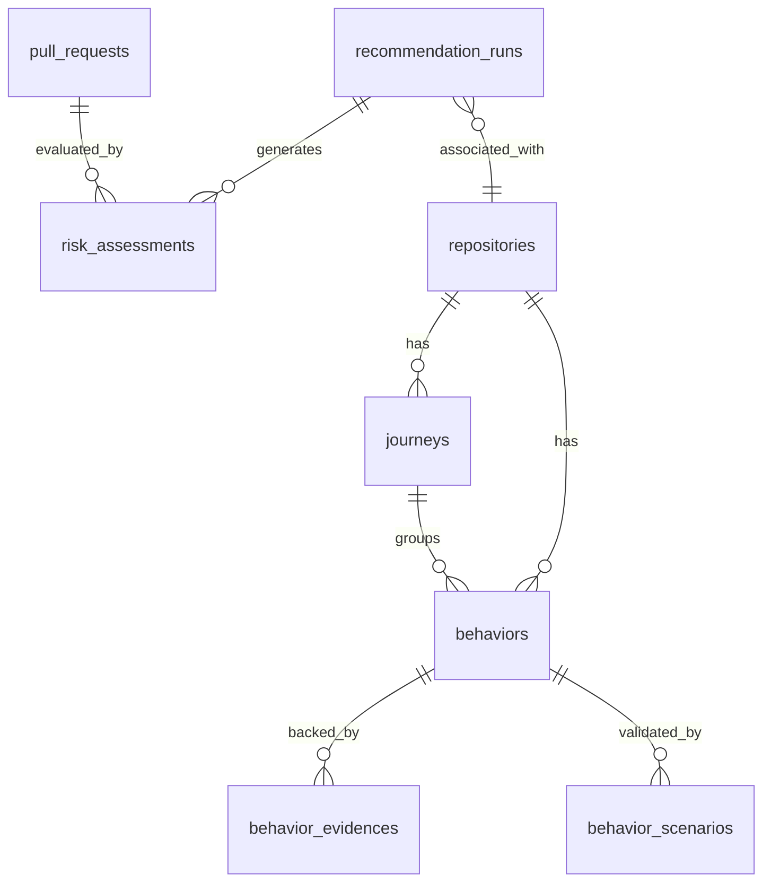

# Journey Intelligence Layer Architecture Proposal

## Overview
The Journey Intelligence Layer standardizes, tracks, and analyzes end-to-end business workflows (User Journeys) in code repositories. By elevating discovery from isolated behaviors to cohesive multi-behavior journeys, we enable deeper context for PR reviews, impact assessments, risk profiling, and testing strategy recommendations.

---

## 1. Deep Inspection & System Alignment

### 1.1 Existential Behaviors & Relationships
From our deep inspection of the current workspace, the behavior catalog manages repository-scoped business capabilities:
- **Core Discovered Behaviors**: `Authentication`, `User Registration`, `Billing`, `Notifications`, `Password Reset`, `User Management`.
- **Behavior Relationships**: Supported types include:
  - `DEPENDS_ON`: Functional dependency (e.g., `Password Reset` depend on `Authentication`).
  - `PART_OF`: Structural composition (e.g., `Password Change` is part of `Authentication`).
  - `EXTENDS`: Specialization (e.g., `Social Login` extends `Authentication`).

### 1.2 Journey Cardinality
**Can multiple behaviors belong to one journey?**
Yes. A User Journey represents a sequence of related capabilities working together to achieve a business outcome.
- **Relationship Cardinality**: `Journey` (1) <---> (Many) `Behavior`.
- **Example**: The *User Onboarding* journey contains `User Registration`, `Email Verification`, and `Profile Setup` behaviors.

### 1.3 Recommendation Influence
Journeys provide critical context to the recommendation engines (e.g., `TestingScopeGenerator` and `TestingStrategyGenerator`):
- **Impact Scoping**: When a file is modified, we map it to behaviors, then resolve those behaviors to their parent journeys. If a change affects multiple behaviors in the same journey, we recommend testing the full end-to-end journey rather than isolated units.
- **Risk Propagation**: High-risk behaviors (e.g., `Billing Checkout`) elevate the risk level of their parent journey (*Subscription Lifecycle*), requiring more comprehensive integration/E2E testing in recommendations.

### 1.4 Model Overlap & Domain Alignment
- **`Journey`**: Represents standardized user workflows. Already exists in `@/app/models/journey.py` but currently lacks intelligence and state mapping.
- **`Behavior`**: Linked directly to journeys via `journey_id` / `journey_name`.
- **`RiskAssessment`**: Linked to PRs and repositories, determining risk levels (`LOW`, `MODERATE`, `HIGH`, `CRITICAL`). Journeys will integrate with this to calculate journey-level risk exposure.

### 1.5 Integration with PR Analysis
- **PR Impact Scoping**: During PR analysis, modified files are tokenized and mapped to behavior candidates. The pipeline will trace these up to the corresponding `Journey` to generate a **Journey Impact Profile**.
- **Contextual Comments**: Instead of "This PR modifies auth/api.py", the system will comment "This PR impacts the *User Authentication* journey, affecting the `Password Reset` dependency."

---

## 2. Entity Relationship Diagram (ERD)



---

## 3. Entity Relationships Specification

### 3.1 `Journey` Model (Standardized Workflow)
```python
class Journey(Base):
    __tablename__ = "journeys"
    id = Column(UUID(as_uuid=True), primary_key=True, default=uuid.uuid4)
    repository_id = Column(UUID(as_uuid=True), ForeignKey("repositories.id", ondelete="CASCADE"), nullable=False)
    name = Column(String, nullable=False)
    slug = Column(String, nullable=False, index=True)
    description = Column(Text, nullable=True)
    risk_level = Column(String, nullable=False, default="MEDIUM")  # LOW, MEDIUM, HIGH, CRITICAL
    
    # Relationships
    repository = relationship("Repository", back_populates="journeys")
    behaviors = relationship("Behavior", back_populates="journey")
```

### 3.2 `Behavior` Model (Updated)
```python
class Behavior(Base):
    __tablename__ = "behaviors"
    id = Column(UUID(as_uuid=True), primary_key=True, default=uuid.uuid4)
    repository_id = Column(UUID(as_uuid=True), ForeignKey("repositories.id", ondelete="CASCADE"), nullable=False)
    journey_id = Column(UUID(as_uuid=True), ForeignKey("journeys.id", ondelete="SET NULL"), nullable=True)
    name = Column(String, nullable=False)
    # ... other fields ...
    
    # Relationships
    journey = relationship("Journey", back_populates="behaviors")
```

---

## 4. Journey Lifecycle

The journey lifecycle manages how user workflows are discovered, validated, and updated:

```mermaid
state_chart
    [*] --> Discovered : "Analyzers find matching behaviors"
    Discovered --> Partially_Validated : "Some behaviors have evidence"
    Partially_Validated --> Validated : "All core behaviors have HIGH confidence evidence"
    Validated --> Deprecated : "Behaviors removed from code"
```

1. **Discovered**: Initial pattern matching links newly discovered behaviors to a journey schema.
2. **Partially Validated**: Evidence is found for some behaviors within the journey, but overall confidence remains moderate.
3. **Validated**: All core behaviors within the journey have validated high-confidence evidences (routes, tests, modules).
4. **Deprecated**: All behaviors representing the journey are deleted or decoupled from the repository.

---

## 5. Recommendation Integration Points

Journeys enrich recommendations at three key stages of the pull request pipeline:

```
[PR Code Change] 
       │
       ▼
1. Trace Modified Files ──> Map to Behaviors ──> Resolve to Journeys
       │
       ▼
2. Evaluate Risk ─────────> Accumulate Behavior Risks to Journey Risk
       │
       ▼
3. Recommend Scope ───────> If Journey is broken, recommend E2E/Integration tests 
                           for the entire Journey workflow (e.g., Must Test)
```

### 5.1 Stage 1: File-to-Journey Impact Resolution
When a PR modifies files, the `PRImpactAnalyzer` resolves those files to behaviors. We extend this to lookup:
```python
affected_journeys = db.query(Journey).join(Behavior).filter(
    Behavior.id.in_(affected_behavior_ids)
).all()
```

### 5.2 Stage 2: Journey-Level Risk Accumulation
If a journey contains any behavior with a risk level of `CRITICAL` or `HIGH`, the journey's overall risk profile is elevated, directly influencing the `RiskAssessment` engine to require rigorous verification of all downstream dependencies.

### 5.3 Stage 3: Workflow-Aware Test Scope Recommendation
Instead of recommending testing a single modified controller, `TestingScopeGenerator` detects if a core transition in a journey is modified, upgrading the recommendation to:
- **Priority Tier**: `Must Test`
- **Category**: `Integration` or `E2E`
- **Item**: "Execute full user flow for: {Journey Name}"
