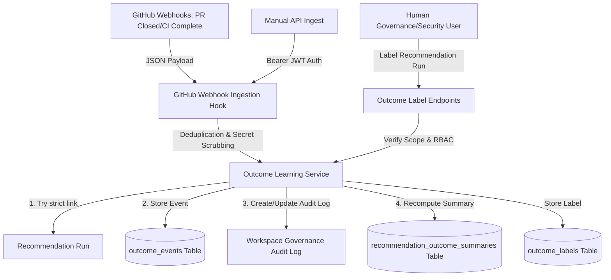

# Phase 9: Outcome Learning

## Overview
Outcome Learning allows Veriscope to continuously calibrate and improve future recommendations, risk profiles, regression scope optimizations, and governance insight models by analyzing what actually happened after a pull request review, merge, deploy, test, or release decision.

It acts as an **advisory-only feedback loop** that digests post-decision events (GitHub and CI triggers) and user labels without mutating historical recommendation evidence, quality gates, release decisions, or GitHub status checks.

## Architecture & Data Flow
The following diagram illustrates how outcome events are ingested and parsed by Veriscope:

## Key Capabilities
1. **Advisory-Only Safety Invariant**: Outcome learning strictly observes a write-once historical isolation barrier. Ingested events and human labels do not rewrite, update, or overwrite any historical evidence snapshot on past recommendation runs.
2. **Deduplication and Idempotency**: Webhook events contain unique delivery IDs. Signature checking ensures duplicate events are dropped or merged cleanly.
3. **Secret Redaction**: Any metadata submitted is scanned recursively to scrub tokens, headers, keys, passwords, and connection strings prior to database persistence and audit logging.
4. **Strict Scoping Boundaries**: Outcome events must match workspace, repository, and commit SHA/PR context exactly. If mapping is ambiguous, the event is saved as "unresolved" for safety.

## Outcome Learning Audit Export

> [!NOTE]
> `OUTCOME_LEARNING_EXPORT_CREATED` is NOT_APPLICABLE in Phase 9 because Phase 9 does not implement an outcome-learning export endpoint. Export support is deferred to a future reporting/export phase. No export action exists, so no export-created audit event is emitted in Phase 9.
